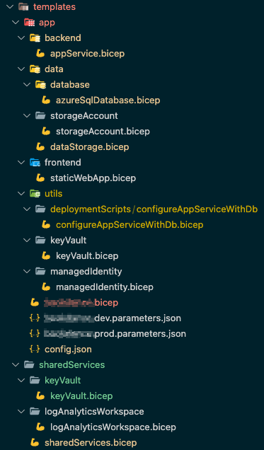
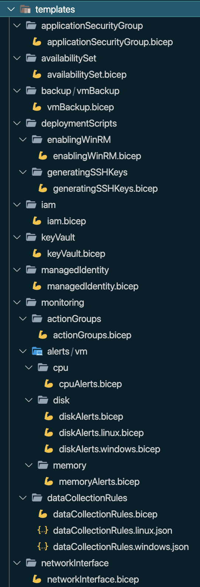
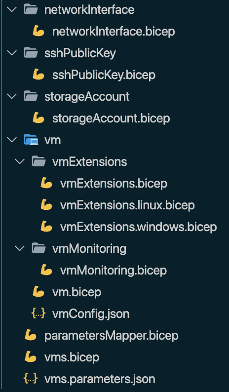

# \[Workshop\] Bicep Infrastructure Developer

## Requirements

- VS Code
- VS Code extensions:
    - Bicep
    - Azure Resource Manager (ARM) Tools
    - Powershell
- Azure Powershell 9.7.1 or higher
- Bicep CLI version 0.22.6 or higher
- Powershell Core 7.2 or higher

## Workshop

### Preparation

1. Create a ‘shared’ key vault with a secret
    1. Remember to check option `Azure Resource Manager for template deployment` - it will be needed later
    2. Available via the public network
    3. After deployment assign the role `Key Vault Secret Officer` to your user
    4. Add secret `MY-CUSTOM-SETTING` with value `HELLO-WORLD`
2. Create two resource groups for training resources (one `dev` and one `prod`)
3. (Optional) Create a folder for training files
4. Here you should have a folder created for training purposes with a Bicep file created and connected to the main repo

### \[E01\] Create storage account template (not parametrized, everything hardcoded)

### \[E02\] Add a parameter for the location with a default value

Docs: 
- [Bicep parameters](https://docs.microsoft.com/en-us/azure/azure-resource-manager/bicep/parameters).
- [Create parameters files for Bicep deployment](https://learn.microsoft.com/en-us/azure/azure-resource-manager/bicep/parameter-files?tabs=Bicep)

### \[E03\] Add ARM JSON parameter file

### \[E04\] Remove JSON parameter file and add `.bicepparam` parameter file (`using` keyword)

### \[E05\] Add decorator for the description of the parameter and allowed values (when you go to the parameter file, then the tip with description and allowed values will be shown)


### \[E06\] Add parameter with description, min length 5 and max length 15 characters for the application name

### \[E07\] Create and use variable for storage account name which uses `appName` parameter as a part of the name.

Docs: [Bicep variables](https://learn.microsoft.com/en-us/azure/azure-resource-manager/bicep/variables).

Remember, that the storage account name must be unique, so add the unique suffix to the resource name.
    
1. Using params/vars in string
2. Functions: `substring`, `uniqueString`
3. Getting info about resource group: `resourceGroup()`

### \[E08\] Change deployment mode to `Complete`

Docs:
- [Azure Resource Manager deployment modes](https://learn.microsoft.com/en-us/azure/azure-resource-manager/templates/deployment-modes)
- [Deletion of Azure resources for complete mode deployments](https://learn.microsoft.com/en-us/azure/azure-resource-manager/templates/deployment-complete-mode-deletion)

### \[E09\] Add blob container for storage as a child resource

Docs: [Existing resources in Bicep](https://learn.microsoft.com/en-us/azure/azure-resource-manager/bicep/existing-resource)

1. `'default' blobServices`  with `existing` key word

### \[E10\] Add additional two containers with loop

Docs: [Iterative loops in Bicep](https://learn.microsoft.com/en-us/azure/azure-resource-manager/bicep/loops)

### \[E11\] Extract container creation as separated resources

1. Dependency between resources
2. Loop on the resource level

### \[E12\] Use `parent` reference to create containers

Docs: [Set name and type for child resources in Bicep](https://learn.microsoft.com/en-us/azure/azure-resource-manager/bicep/child-resource-name-type)

### \[E13\] Create Function app

1. Consumption plan (`Y1/Dynamic`)
2. Uses the existing storage account
3. Runs on Windows & .NET
    1. Not all regions support Linux App Service Plans. Linux App Service Plan requires properties `kind: 'linux’` and `properties: { reserved: true }` - issue known from old times
4. Functions v4
5. Enforces HTTPS connections
6. Add enforcing HTTPS connection to storage account
7. [Quickstart: Create and deploy Azure Functions resources using Bicep](https://learn.microsoft.com/en-us/azure/azure-functions/functions-create-first-function-bicep?tabs=CLI)

### \[E14\] Parametrize blob container names (array)

### \[E15\] Extract storage creation to module

Docs:
- [Bicep modules](https://learn.microsoft.com/en-us/azure/azure-resource-manager/bicep/modules)
- [Outputs in Bicep](https://learn.microsoft.com/en-us/azure/azure-resource-manager/bicep/outputs?tabs=azure-powershell)

1. Create new file `templates/storage.bicep`
2. Move storage-related codes to the new file
3. Return storage name as output from the module deployment (`output`)
4. Disclaimer - now the templates are not deployable due to loss of storage reference

### Examples of the module structures

#### Example 1

Simple app infrastructure with a storage account and function app.



#### Example 2

Templates modularization for VM creation.





### \[E16\] Call the storage module in the main file

1. Deployment name - should be unique and max 64 characters in length
2. The default basic deployment name is the file name of the main template
3. Generate the main deployment name in a script: https://github.com/Azure/bicep/issues/10129

### \[E17\] Extract function app creation to module

1. Create new file `templates/functionApp.bicep`
2. Move function app-related codes to the new file
3. Refer to the existing storage account deployed in another module (`existing`)
4. Return function app URL as output from the module deployment

### \[E18\] Call the function app module in the main file

1. Deployment name - should be unique and max 64 characters in length
2. Return function app URL as output from the deployment of the template (the URL should be visible in script output)
3. Templates are deployable again

### \[E19\] Add a new app setting in the function app where the value 

The parameter in the module must be marked as `@secure` as it is taken from Key Vault.

### \[E20\] Create a static config file

Docs:
- [Shared variable file pattern](https://learn.microsoft.com/en-us/azure/azure-resource-manager/bicep/patterns-shared-variable-file)
- [Use Azure Key Vault to pass secure parameter value during Bicep deployment](https://learn.microsoft.com/en-us/azure/azure-resource-manager/bicep/key-vault-parameter?tabs=azure-cli)
- [Resource group deployments with Bicep files](https://learn.microsoft.com/en-us/azure/azure-resource-manager/bicep/deploy-to-resource-group?tabs=azure-cli)
- [Set scope for extension resources in Bicep](https://learn.microsoft.com/en-us/azure/azure-resource-manager/bicep/scope-extension-resources)

1. Use Shared Variable Pattern
3. Create `templates/staticConfig.json` file
4. Add the content to the file with the below format (and fulfill your values):
    
    ```json
    {
        "sharedKeyVault": {
            "resourceGroupName": "",
            "keyVaultName": ""
        }
    }
    ```
    
5. Refer to the secret with a reference to the Key Vault (`existing`, `getSecret` function)
6. Remember about the indication of scope of the Key Vault (`resourceGroup`)
8. Difference between `scope` and `targetScope`

### \[E21\] Move secret reference to a parameter file

Docs:
- [Reference-secrets-in-parameters-file](https://learn.microsoft.com/en-us/azure/azure-resource-manager/bicep/key-vault-parameter?tabs=azure-cli#reference-secrets-in-parameters-file)
- [Use Azure Key Vault to pass secure parameter value during Bicep deployment](https://learn.microsoft.com/en-us/azure/azure-resource-manager/bicep/key-vault-parameter?tabs=azure-cli)

### Create manually container registry in a shared resources resource group

### Publish the storage module to the created container registry

Docs:
- [Bicep modules: File in registry](https://learn.microsoft.com/en-us/azure/azure-resource-manager/bicep/modules#file-in-registry)
- [bicep publish](https://learn.microsoft.com/en-us/azure/azure-resource-manager/bicep/bicep-cli#publish)

1. `az bicep publish --file ./templates/storage.bicep --target br:<cr_name>.azurecr.io/storage:1.0.0`
4. Use tag 1.0.0
5. Read more about semantic versioning: https://semver.org/

### \[E22\] Replace the calling storage module in a file with calling module from a container registry

1. Behind the scene `bicep restore` command is called (to restore modules locally)

### \[E23\] Add conditional deployment to storage module - if the parameter that contains blob container names is empty, then deploy the `default` container

Docs: 
- [Conditional deployments in Bicep with the if expression](https://learn.microsoft.com/en-us/azure/azure-resource-manager/bicep/conditional-resource-deployment)
- [Array functions for Bicep](https://learn.microsoft.com/en-us/azure/azure-resource-manager/bicep/bicep-functions-array)

2. `for` loop doesn’t need to be changed - if an array contains zero elements, the loop will be done zero times
4. Do the required changes in the storage module
5. Publish new module version (1.1.0)
6. Update the main template to use the newest module version
7. Complete deployment mode doesn’t work on the storage level - it shows where the responsibility for resource management should be placed

### \[E24\] In a parameter file replace the hardcoded reference to KV with a reference taken from the `staticConfig.json` file

1. Add a new field with the `subscriptionId`
2. Store secret name as a variable in the parameter file
